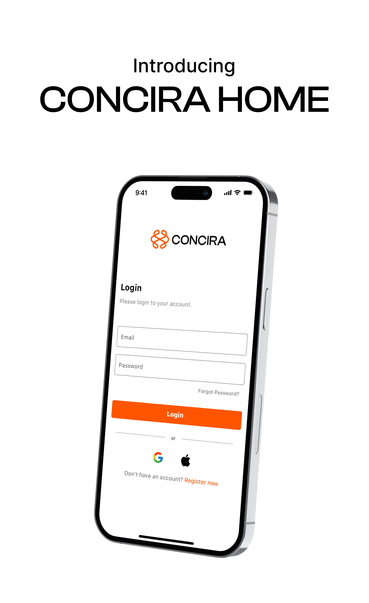
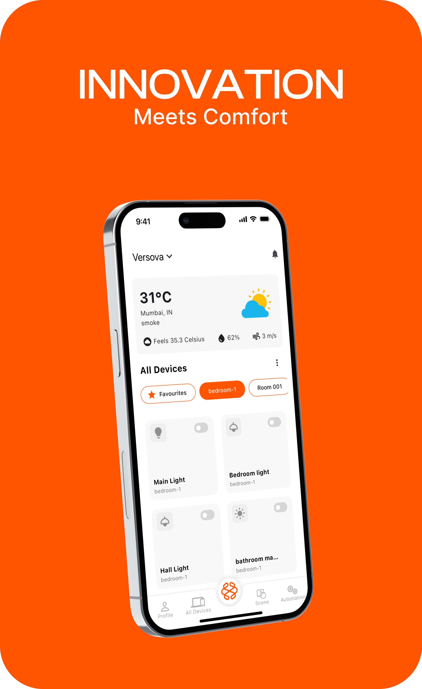
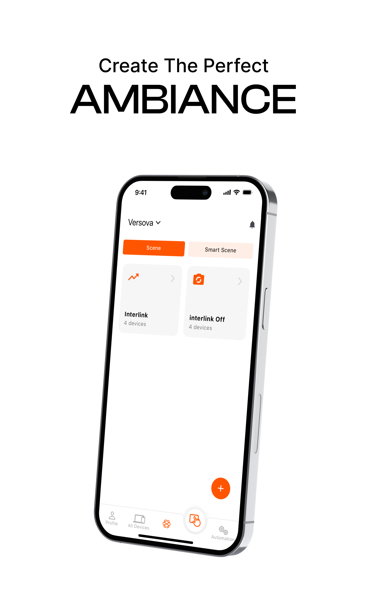
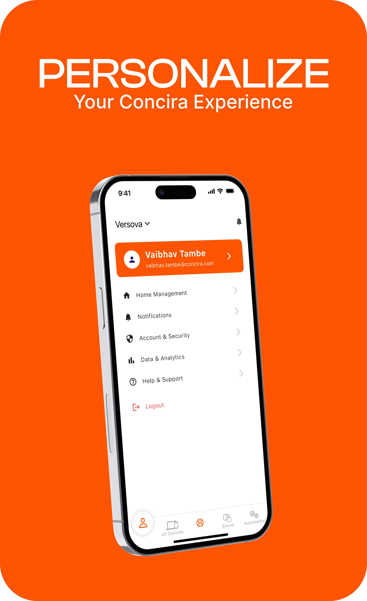

# concira-home

Flutter smart home automation app for seamless control of multiple homes. Scene management, energy analytics, two-way device control, and member access management for modern living.

> **Note:** This is a proprietary project. Source code is confidential and not publicly available.

---

## 📱 Overview

Concira is a comprehensive home automation solution that provides intuitive control over smart devices across multiple homes. Built with Flutter, it offers personalized experiences, energy monitoring, and sophisticated scene management for modern smart living.

## ✨ Key Features

- **Multi-Home Management** - Control and monitor multiple properties from a single app
- **Scene Management** - Create custom scenes to control multiple devices with one tap
- **Smart Scenes** - Automated scenes based on time, location, or conditions
- **Two-Way Device Control** - Manage lights, switches, fans, and smart devices
- **Energy Analytics** - Real-time electricity usage and power consumption tracking
- **Member Management** - Add family members with customizable access permissions
- **Weather Integration** - Local weather data with "feels like" temperature
- **Device Categorization** - Organize devices by rooms and favorites
- **Voice Control Ready** - Integration support for voice assistants

## 🛠️ Tech Stack

- **Flutter** (Dart) - Cross-platform mobile framework
- **REST API** - Device control and management
- **Real-time Sync** - WebSocket for instant device status updates
- **Weather API** - Live local weather data integration
- **Secure Authentication** - OAuth 2.0 with Google/Apple Sign-In

## 📸 Screenshots

### Login Screen

### All Devices Dashboard

### Scene Management

### Profile Settings

---

## 🔄 How It Works

1. **Setup Your Home**
   - Register and log in via email or social accounts
   - Add your home location and connect smart devices
   - Organize devices by rooms (bedroom, hall, bathroom, etc.)

2. **Create Scenes**
   - Select multiple devices for a scene (e.g., "Movie Night")
   - Set device states (lights dim, TV on, curtains closed)
   - Activate entire scenes with one tap or voice command

3. **Monitor & Control**
   - View all devices at a glance with status indicators
   - Toggle devices on/off individually or by groups
   - Access favorites for quick control
   - Check energy consumption in real-time

4. **Manage Access**
   - Invite family members with custom permissions
   - Set access levels (admin, user, guest)
   - Track device usage by members
   - Revoke access anytime

5. **Automate Your Life**
   - Create smart scenes triggered by time or conditions
   - "Good Morning" scene activates at sunrise
   - "Away Mode" when location changes
   - Energy-saving mode during peak hours

---

## 👥 User Roles

### Admin
- Full control over all devices and settings
- Add/remove members and set permissions
- Access to energy analytics and billing
- Create and manage scenes

### User (Family Member)
- Control authorized devices
- Create personal scenes
- View energy data
- Limited settings access

### Guest
- Temporary access to specific devices
- View-only for most features
- Time-limited permissions

---

## 🎨 Design

**Concira Brand Colors:**
- Primary Orange: `#FF5722` | Accent: `#FF6F00`
- Background: `#FFFFFF` | Card: `#F5F5F5`
- Text Dark: `#212121` | Text Light: `#757575`
- Success: `#4CAF50` | Warning: `#FFC107`

**Design Principles:**
- Clean, minimalist interface
- High contrast for easy visibility
- Large touch targets for device controls
- Real-time visual feedback
- Intuitive iconography

---

## 🏠 Device Categories

- **Lighting** - Smart bulbs, LED strips, dimmers
- **Climate** - Thermostats, AC units, fans
- **Security** - Smart locks, cameras, sensors
- **Entertainment** - TV, speakers, media players
- **Appliances** - Smart plugs, switches, outlets

---

## 📊 Analytics Features

- **Energy Consumption** - Daily, weekly, monthly usage graphs
- **Cost Tracking** - Electricity bill estimation
- **Device Efficiency** - Power usage by device
- **Usage Patterns** - Peak consumption times
- **Recommendations** - AI-powered energy-saving tips

---

## 🔐 Security & Privacy

- End-to-end encryption for device commands
- Secure OAuth 2.0 authentication
- Local network control option
- Two-factor authentication support
- Privacy-first data handling
- Regular security audits

---

## 📈 Project Info

- **Platform:** Android & iOS
- **Development:** 8+ months
- **Active Users:** Growing user base
- **Smart Devices Supported:** 50+ brands
- **API Integrations:** 10+

---

## 🚀 Future Enhancements

- [ ] AI-based automation suggestions
- [ ] Energy prediction algorithms
- [ ] Apple HomeKit & Google Home integration
- [ ] Wearable device support (Apple Watch, Wear OS)
- [ ] Geofencing automation
- [ ] Voice assistant (Alexa, Google Assistant, Siri)
- [ ] Advanced scheduling with sunrise/sunset
- [ ] Multi-language support
- [ ] Offline mode with local network control
- [ ] Smart notifications for unusual activity

---

## 📄 License

This project is proprietary and confidential. All rights reserved.

---

## 📧 Contact

**Developer:** [Your Name]  
**Email:** [your.email@example.com]  
**LinkedIn:** [Your LinkedIn]  
**Portfolio:** [Your Website]

---

**⭐ Interested in smart home solutions?** Feel free to reach out for collaboration opportunities!

---

**License:** Proprietary - All Rights Reserved © 2024